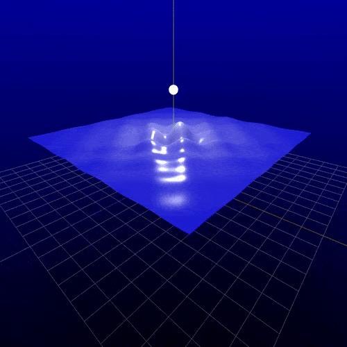

# DefinedMotion - An animation library

This is a programmatic animation library, similar to 3Blue1Brown's Manim or Motion Canvas. It focuses on giving a very tight feedback loop for the development by just saving file to see updates directly (hot reload). It uses Three.js as rendering backend to get very performant rendering.


The key features of this project are:

* Hot reload by just saving file.
* Strong 2D and 3D rendering supported by Three.js
* The animation is declaratively specified.
* Very easy to create new primitives and define animations.
* Interactive viewport for inspection of scene.
* It's easy to express dependencies, which technical animations often have.

<table>
  <tr>
    <td></td>
    <td></td>
  </tr>
</table>



## Look at example scenes
Visit /src/renderer/src/scenes and look how scenes are made, this is likely a good way to learn the library.


### Create Scene 
```ts
export const yourSceneName = (): AnimatedScene => {
  return new AnimatedScene(1920, 1080, true, true, async (scene) => {

  })
}

```

### Scene tasks
```ts

  return new AnimatedScene(1920, 1080, true, true, async (scene) => {
    ...

    scene.addAnim(/* add animation, these will run in parallel*/)

    scene.onEachTick((tick, time) => {
        /* Run this function for every tick/frame */
        /* This is often used to set up dependencies or calculated movements */
        /* Conceptually it can be "On each tick, set the line endings at the position of sphere A and sphere B", this will make the line updated regardless of what happens to sphere A and B */
    })

    scene.do(() => {
        /* Add instruction at current tick/frame.
        This can be any function, it will be called at the tick.

        Often used to for example add elements to the scene
        */
    })

    scene.addWait(1000) //Will add an animation that does nothing (waits) for the duration

    scene.insertAnimAt(tick, /* animations */ ) // Works like addAnim(...) but you can just insert an animation anywhere anytime. You can insert animations in the future or present during onEachTick. This is very powerful for complex animations.

    scene.addSequentialBackgroundAnims(/* Animations, these will run in sequence */) // This function allows you to add animations that will not push the timeline pointer, if you are at frame X and add an animation that is 300 frames long, this will not make the next added thing to be at X+300, but instead just X (because this adds it in the "background").


    // Register an audio before use, this function is often used in the absolute beginning of the scene.
    scene.registerAudio(/* audio path */)

    // Anywhere in the code (but after registerAudio of the sound), play the sound
    scene.playAudio(/* audio path */, volume)
    ...
  })

```

This project is very new, more documentation will come soon.


## Project Setup
 
1. Clone this repo, and work within the folder /src/renderer/src/scenes.
You can create a folder like /src/renderer/src/scenes/yourname.
2. Install all dependencies with `npm install`
3. Run the animation viewer with `npm run dev`
4. Update the entry.ts file to use your animation.
5. When you want to render your animation, click "Render". You will need to have ffmpeg on your system and available in your system PATH.

This will hopefully have better documentation soon. If you have any questions, feel free to contact me at hugo.contact01@gmail.com

## Example scene 
#### Animated function surface
```ts
export const surfaceScene = (): AnimatedScene => {
  return new AnimatedScene(1500, 1500, true, false, async (scene) => {
    const funcMinMaxes: [number, number, number, number] = [-7, 7, -7, 7]

    addBackgroundGradient({
      scene,
      topColor: COLORS.blue,
      bottomColor: COLORS.black,
      lightingIntensity: 10
    })

    const gridHelper = new THREE.GridHelper(20, 20)
    const axesHelper = new THREE.AxesHelper(20)

    const sineSurface = createFunctionSurface(sineTimeFunction(0), ...funcMinMaxes)
    sineSurface.material = surfaceMaterial

    const geometry = new THREE.SphereGeometry(0.3, 32, 32)
    const material = sphereMaterial

    const sphere = new THREE.Mesh(geometry, material)
    const pointLight = new THREE.PointLight(0xffffff, 50) // color, intensity, distance
    pointLight.position.copy(sphere.position)
    const group = new THREE.Group()
    group.add(sphere, pointLight)

    scene.add(gridHelper, axesHelper, sineSurface, group)

    scene.camera.position.set(3.889329, 7.895859, 10.51772)
    scene.camera.rotation.set(-0.6027059, 0.3079325, 0.2056132)
    const centerPoint = new THREE.Vector3(0, 0, 0)
    const distance = scene.camera.position.distanceTo(centerPoint)
    let angle = 0

    scene.onEachTick((tick) => {
      const func = sineTimeFunction(tick / 20)
      updateFunctionSurface(sineSurface, func, ...funcMinMaxes)

      group.position.y = 6

      angle += 0.005

      // Set camera position in circular orbit
      scene.camera.position.x = (Math.sin(angle) * distance * (Math.sin(tick / 50) + 2)) / 2
      scene.camera.position.z = (Math.cos(angle) * distance * (Math.sin(tick / 50) + 2)) / 2

      // Make camera look at center
      scene.camera.lookAt(centerPoint)
    })

    scene.addWait(10_000)
  })
}

```

Previous names for this repository have been: 
* TickMotion
* MotionByDefinition