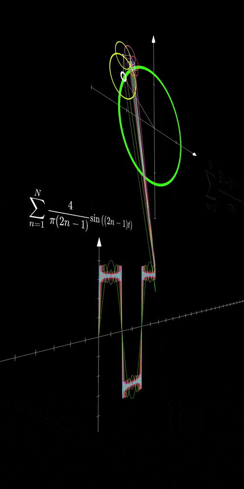
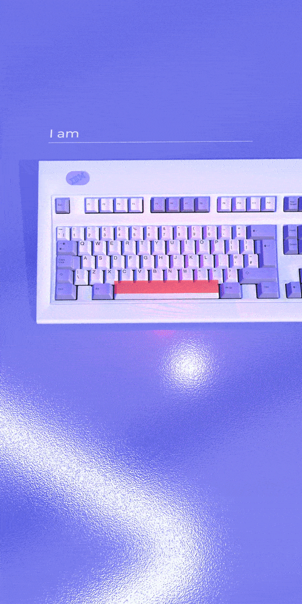
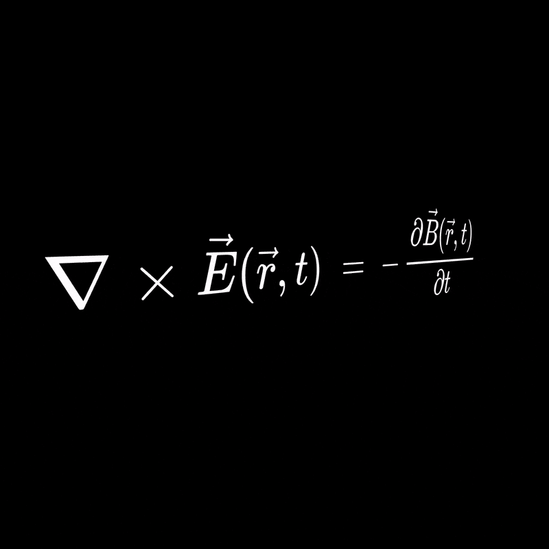
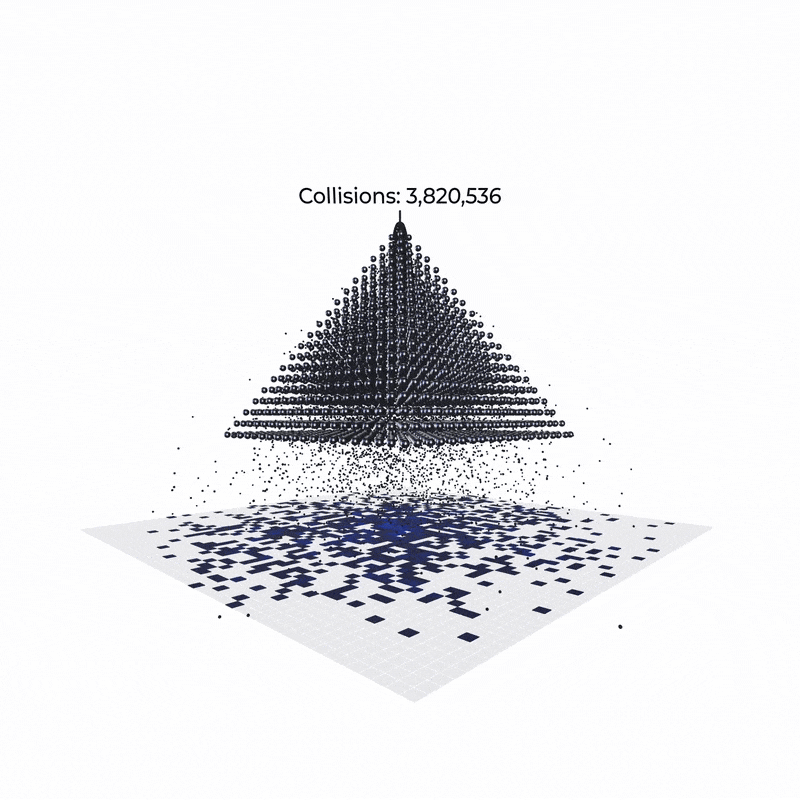
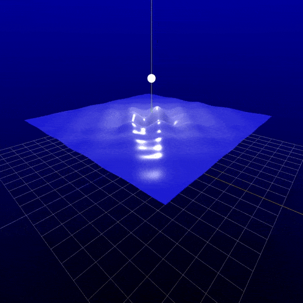
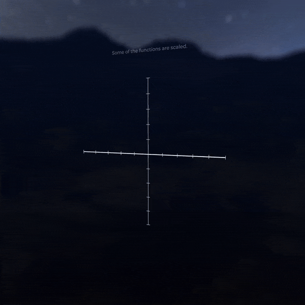
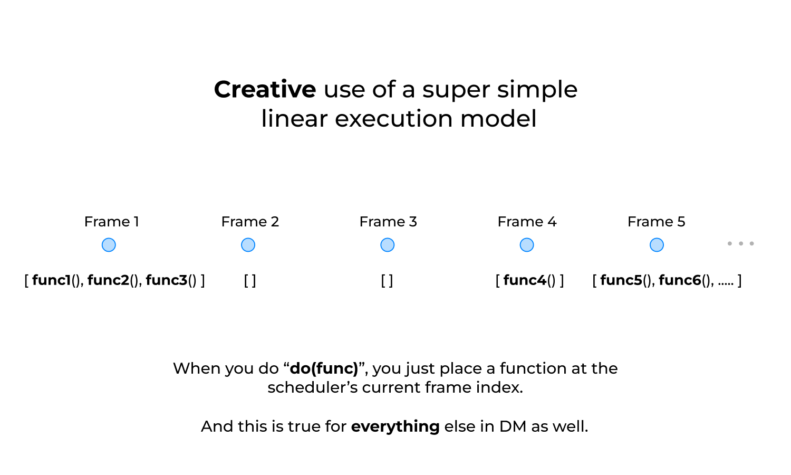

# DefinedMotion - Programmatic Animations

###  Animate Three.js with all its power

This is a programmatic animation library, similar to 3Blue1Brown's Manim or Motion Canvas. It focuses on giving a tight feedback loop for development by seeing changes on save (hot reload) and providing the best capabilities for technical animations, both in 2D and 3D.


### Quick overview

- ⚡ **Hot-reload on save**  
  Tweak something, hit save, and see the change instantly in the viewer. No “render first, see later”. Saves minutes per iteration on heavy scenes.

- 🌌 **Full Three.js ecosystem**  
  Use *any* Three.js primitive or addon: PBR materials, lights, HDRI, helpers, post-processing, model loaders, controls — if it works in Three.js, you can animate it.

- 🚀 **One-line project setup**  
  Create a ready-to-run project with `npx create-definedmotion my-project` 

- 🔐 **Type-safe animations with TypeScript**  
  Build reusable helpers and scenes with full IDE support, refactors, and autocomplete.

- 🧭 **Interactive viewer**  
  Navigate your scene, orbit the camera, and copy the current position/rotation so you don’t have to guess values in code.

- 🧱 **Simple, low-level animation scheduler**  
  A small set of primitives (`addAnims`, `addDeferredAnims`, `onEachTick`, `doAt`, background sequences…) that stays easy to reason about and makes it trivial to build your own higher-level components and animation primitives.

- 🤖 **Great chatbot / AI assistant compatibility**  
  Because it uses standard TypeScript + Three.js, modern coding assistants already “understand” your scenes, shaders, loaders, cameras, and math, and can help you write and debug DefinedMotion code even though the library is new.

- 🎥 **One-click rendering**  
  When you’re happy with the result, click **Render** in the viewer. You only need FFmpeg installed when you’re ready for the final video.


<table>
  <tbody>
    <tr>
      <td></td>
      <td></td>
    </tr>
    <tr>
     <td></td>
      <td></td>
    </tr>
    <tr>
    <td></td>
    <td></td>
     </tr>
  </tbody>
</table>

## Why the need for a new animation solution?

**Manim** (community) has great **LaTeX capabilities**, ease of use, and community, but a relatively **weak 3d engine**, slow performance and slow iterations.

**Motion Canvas** is great but is **mostly 2D** and its heavy use of **generator functions** can be a bit unconventional.

**Remotion** fits the niche of making scenes with **React**, but is more for **motion graphics** than general technical animations, it is also based on a custom **free/commercial license** depending on use case.


## How does it compare?

| Feature                  | **DefinedMotion**                                                                                               | **Manim (Community)**                                                                  | **Motion_Canvas**                                                                                           |
|--------------------------|-----------------------------------------------------------------------------------------------------------------|----------------------------------------------------------------------------------------|-------------------------------------------------------------------------------------------------------------|
| **Performance**          | ⚡ Realtime playback in the viewer, even for heavy 3D scenes – no video render needed while iterating.          | Built for offline renders; seeing scenes often means waiting for a render             | ⚡ Realtime 2D playback in the viewer. No video render needed while iterating. However, no built-in 3D engine.                             |
| **Hot reload**           | ✅ Hot reload on save as a core workflow with timeline scrubbing.                                                                        | File-watch/CLI loops exist, but you still wait for each render (no true live hot reload) | ✅ Hot reload on save as a core workflow with timeline scrubbing.                                                    |
| **3D & rendering engine**| 🌌 Full **Three.js ecosystem**: PBR materials, lights, HDRI, helpers, post-processing, addons etc                  | Custom engine, 2D-first; 3D is possible but with less engine/ecosystem depth than Three.js | Designed for 2D Canvas. Great toolkit for this.             |
| **3D model import**      | 📦 Use any Three.js loader (GLTF/GLB, OBJ, FBX, STL, etc.) – imported models become first-class scene objects   | 3D object support is more limited; importing arbitrary 3D formats is possible but not a core focus | No native 3D mesh import; typically you work with shapes, images, and SVG in 2D                             |
| **Viewer & interaction** | 🧭 Interactive 3D and 2D viewer with timeline and helpers for camera handling.                            | A preview window. Often rendering to video and watching that.    | Great UI. Interactive 2D viewer with timeline and many helpers    |
| **Low-level control**    | 🧱 Low-level access: you work directly with Three.js objects and it's easy to build your own animation primitives      | Object model is extensible but more opinionated, deeper engine changes take more work. | Somewhat modular. Possibly awkward due to heavy use of generator functions and custom made engine.             |
| **LaTeX & math text**    | 🧮 LaTeX → SVG → 3D, plus APIs to query positions of substrings (for precise highlights, braces, arrows, etc.). LaTeX becomes true 3D. | Excellent LaTeX support out of the box, huge example base; finer spatial control is more manual | Great 2D LaTeX support with transitions.                     |
| **Install & first run**  | 🚀 `npx create-definedmotion my-project` – one line and you have it set up                                  | Python env + Manim install,  well-documented, lots of community resources. Very heavy LaTeX dependecy (~3–5GB).         | Nice easy setup. Uses npm like DM                             |
| **Rendering to video**   | 🎥 One-click render in the viewer, you only need `ffmpeg` when you’re ready for the final video                | Mature CLI rendering. Requires ffmpeg.                    | Easily rendering from the viewer. Requires ffmpeg.                                       |
| **Chatbot / AI support** | 🤖 Very good: all major chatbots understand **TypeScript + Three.js**, so they can help with almost everything even though DefinedMotion is new | 🤖 Very good: Manim has a huge footprint; plus Python is well supported by chatbots | 🤖 Good; smaller ecosystem than Three.js means fewer pre-existing examples for assistants to draw from. |
| **Best fit for…**        | Technical animations in general, complex heavy scenes, math/CS/physics visuals, and Three.js-native workflows with fast iteration & hot reload | Math lectures, proofs, blackboard-style animations, especially in Python-centric stacks | 2D explainers with a visual timeline and audio sync. Nice primitives for building flexbox-like layouts and showing code |

## A dead-easy architecture


## Look at example scenes
DefinedMotion includes **12 example scenes** and **34 tests** to help you learn and verify functionality. Browse `/src/example_scenes` to see complete, working animations you can run immediately.


### Create Scene 
```ts
export const yourSceneName = (): AnimatedScene => {
  return new AnimatedScene(1920, 1080, SpaceSetting.ThreeDim,
    HotReloadSetting.TraceFromStart, async (dm) => {

  })
}

```

### Scene tasks (cheatsheet)
```ts

  return new AnimatedScene(1920, 1080, SpaceSetting.ThreeDim,
    HotReloadSetting.TraceFromStart, async (dm) => {
    ...

    dm.addAnims(/* add animations, these will run in parallel*/)

    dm.addDeferredAnims(/* add animations functions, these will run in parallel. 
    The animations will be evaluated later to use the values that will be when the animation starts.*/)

    dm.onEachTick((frame, time) => {
        /* Run this function for every tick/frame */
        /* This is often used to set up dependencies or calculated movements */
        /* Conceptually it can be "On each tick, set the line endings at the position of sphere A and sphere B", this will make the line updated regardless of what happens to sphere A and B */
    })

    dm.do(() => {
        /* Add instruction at current tick/frame.
        This can be any function, it will be called at the tick.

        Often used to for example add elements to the scene
        */
    })

     dm.doAt(frame, () => {
        /* Add instruction at a certain tick/frame.
        This can be any function, it will be called at the tick.

        Often used to for example add elements to the scene
        */
    })

    dm.addWait(1000) //Will add an animation that does nothing (waits) for the duration

    dm.insertAnimsAt(frame, /* animations */ ) // Works like addAnims(...) but you can just insert an animation anywhere anytime. You can insert animations in the future or present during onEachTick. This is very powerful for complex animations.

    dm.addSequentialBackgroundAnims(/* Animations, these will run in sequence */) // This function allows you to add animations that will not push the timeline pointer, if you are at frame X and add an animation that is 300 frames long, this will not make the next added thing to be at X+300, but instead just X (because this adds it in the "background").


    // Register an audio before use, this function is often used in the absolute beginning of the scene.
    dm.registerAudio(/* audio path */)

    // Anywhere in the code (but after registerAudio of the sound), play the sound
    dm.playAudio(/* audio path */, volume)
    ...
  })

```


## Project Setup
 
1. Run `npx create-definedmotion project_name`
2. Install all dependencies with `npm install`
3. Run the animation viewer with `npm run dev`
4. Add your scene in src/scenes
5. Update the src/entry.ts file to use your animation.
6. When you want to render your animation, click "Render". You will need to have ffmpeg on your system and available in your system PATH.


## The DefinedMotion Scheduler

The scheduler is the core system that manages when animations run, when instructions execute, and how your scene progresses through time. It's designed to be simple and predictable while giving you complete control over timing.

### Planning Phase vs Runtime Phase

DefinedMotion uses a two-phase execution model:

1. **Planning Phase (Build Time)**: When your scene function is called, the entire animation is planned upfront. The scheduler records what should happen at each tick—animations, instructions, dependencies—but doesn't execute anything yet. Think of it like writing a script for a play.

2. **Runtime Phase**: After planning is complete, the scheduler executes the plan tick-by-tick, running animations and updating your scene based on the blueprint created during planning.

This separation is crucial for features like hot reload, timeline scrubbing, and rendering—the scheduler can jump to any frame because it knows the complete plan.

### How It Works

The scheduler operates on a **tick-based timeline**, where each tick represents one frame of your animation. Think of it like a filmstrip—each tick is one frame, and the scheduler decides what happens at each frame.
```
Tick:  0    1    2    3    4    5    6    7    8
       |----|----|----|----|----|----|----|----|

Anim:  [=======animation=======]
                                     ⚡ instruction
Deps:  ●----●----●----●----●----●----●----●----●
       (runs every tick)
```

**What you see:**
- `[====]` = Animation spanning multiple ticks
- `⚡` = Instruction executing at one tick
- `●----●` = Dependencies updating every tick

### The Timeline Pointer

The scheduler maintains an internal **calculation tick** that tracks where you are in the scene setup during the planning phase. When you add animations or instructions, they're scheduled relative to this pointer:
```typescript
// You're at tick 0
scene.addAnims(animation1)  // Runs from tick 0–499
// Now you're at tick 500
scene.addAnims(animation2)  // Runs from tick 500–999
// Now you're at tick 1000
```

The calculation tick **only moves forward** when you add animations or a wait (just an animation that does nothing). Instructions (`do()`, `doAt()`) and dependencies (`onEachTick()`) don't move it.

### Core Scheduling Functions

#### `addAnims(...animations)`
Schedules animations to run in parallel starting at the current tick, then advances the timeline by the longest animation's duration.
```typescript
// Both fade in together, scene advances by 800 ticks (longest duration)
scene.addAnims(
  fadeIn(sphere, 800),
  fadeIn(cube, 500)
)
```

#### `addDeferredAnims(...animationFactories)`
Like `addAnims()`, but animations are created when they actually run (at runtime), not during scene setup (at plan/build time). This lets you use live values instead of values captured at plan time.
```typescript
// BAD: easeInOutQuad is called during planning phase
// It reads sphere.position.x at plan time (probably 0)
// Creates interpolation from 0 → 10
scene.addAnims(
  createAnim(easeInOutQuad(sphere.position.x, 10, 500), (value) => {
    sphere.position.x = value
  })
)

// GOOD: easeInOutQuad is called at runtime when animation starts
// It reads sphere.position.x at runtime (after previous animations moved it)
// Creates interpolation from current position → 10
scene.addDeferredAnims(
  () => createAnim(easeInOutQuad(sphere.position.x, 10, 500), (value) => {
    sphere.position.x = value
  })
)
```

**Important:** The scheduler still needs to know duration at planning time, so it calls each factory once during the planning phase just to measure duration, then calls it again at runtime to get the actual animation with current values.

#### `insertAnimsAt(tick, ...animations)`
Inserts animations at any specific tick, even from inside `onEachTick()`. This is powerful for complex conditional logic.
```typescript
scene.onEachTick((tick) => {
  if (collision detected at tick 500) {
    // Dynamically insert an explosion animation
    scene.insertAnimsAt(500, explosionAnim)
  }
})
```

#### `do(instruction)`
Executes a function at the current tick. Doesn't advance the timeline.
```typescript
scene.do(() => {
  scene.add(newObject)
  console.log('Added at tick', scene.getCurrentTimeMs())
})
```

#### `doAt(tick, instruction)`
Executes a function at a specific tick (not limited to the schedulers current position).
```typescript
scene.doAt(1000, () => {
  object.material.color.set(0xff0000)
})
```

#### `onEachTick(updater)`
Registers a function that runs every single tick throughout the entire animation. Great to produce calculated movements or update dependencies like the line ends below.
```typescript
// Keep line endpoints synced with moving spheres
scene.onEachTick((tick, timeMs) => {
  line.updatePositions(sphereA.position, sphereB.position)
})
```

#### `addSequentialBackgroundAnims(...animations)`
Runs animations in sequence but **doesn't advance the timeline**. Useful for background activity.
```typescript
// Timeline stays at 0, but background sequence runs for 1500 ticks
scene.addSequentialBackgroundAnims(
  animation1,  // 0–499
  animation2,  // 500–999
  animation3   // 1000–1499
)

// Next addAnims() still starts at tick 0
scene.addAnims(mainAnimation)
```

#### `addWait(durationMs)`
Advances the timeline without any visible changes. Useful for pacing.
```typescript
scene.addAnims(fadeIn(object, 500))
scene.addWait(2000)  // Hold for 2 seconds
scene.addAnims(fadeOut(object, 500))
```

### Execution Order Within a Tick

When the scheduler processes a single tick at runtime, it executes in this order:

1. **Instructions** (`do()`, `doAt()`) — Scene modifications
2. **Animations** (`addAnims()`, `insertAnimsAt()`) — Property updates
3. **Dependencies** (`onEachTick()`) — Derived updates

This ordering ensures dependencies always see the latest state from animations.

### Hot Reload Behavior

The scheduler supports three hot reload modes:

- **TraceFromStart**: Replays values updates for all ticks from 0 to current when you save. Accurate but slow for long scenes.
- **BeginFromCurrent**: Jumps directly to current tick using only instructions before it. Fast but may miss accumulated state (like `angle += 0.01`).
- **BeginFreshOnSave**: Restarts from tick 0 when you save.

Example of accumulated state issue:
```typescript
let angle = 0
scene.onEachTick(() => {
  angle += 0.01  // Accumulates over time
  sphere.rotation.y = angle
})
// With BeginFromCurrent, angle won't be correct at tick 500
// With TraceFromStart, it will be
```

### Audio Scheduling

Audio is scheduled alongside animations:
```typescript
scene.registerAudio(audioPath)  // Load first

scene.do(() => {
  scene.playAudio(audioPath, volume)  // Plays at current tick
})
```

During rendering, audio events are collected and exported as a soundtrack synced to the video.

### Timeline Conversion

The scheduler provides helpers for converting between ticks and time:
```typescript
const ms = ticksToMillis(ticks)    // Ticks → milliseconds
const t = millisToTicks(ms)         // Milliseconds → ticks
const fps = renderOutputFps()       // Final render frame rate
```


### Key Takeaways

- The entire animation is **planned upfront** during the planning phase, then executed tick-by-tick at runtime
- The scheduler is **deterministic**: same code always produces same animation
- Use `addDeferredAnims()` when you need values at runtime, not values at plan/build time
- `onEachTick()` runs every frame and sees all prior updates
- `insertAnimsAt()` enables dynamic, conditional animations
- Background sequences let you layer independent timelines
- Hot reload modes trade accuracy for speed during development

## Interpolations and Animations

DefinedMotion's animation system is built on a simple but powerful concept: **interpolations are just arrays of numbers**, and **animations pair those arrays with updater functions**.

### What is an Interpolation?

An interpolation is simply a `number[]` — an array of pre-calculated values, one per frame. That's it. During the planning phase, these arrays are generated once and stored. At runtime, the scheduler walks through them tick-by-tick.
```typescript
// This creates an array like [0, 0.02, 0.08, 0.18, ..., 9.82, 9.92, 9.98, 10]
const interpolation = easeInOutQuad(0, 10, 500)  // 500ms from 0 to 10

console.log(interpolation.length)  // Number of frames (ticks)
console.log(interpolation[0])      // 0
console.log(interpolation[100])    // Some intermediate value
```

This approach has major advantages:
- **Predictable**: Same input always produces same output
- **Fast**: No expensive easing calculations at runtime
- **Flexible**: Easy to combine, reverse, or modify
- **Debuggable**: You can inspect the exact values

### Built-in Interpolation Functions

DefinedMotion provides several interpolation generators:

#### `easeLinear(start, end, durationMs)`
Linear interpolation from start to end.
```typescript
const linear = easeLinear(0, 100, 1000)  // [0, 1, 2, 3, ..., 98, 99, 100]
```

#### `easeInOutQuad(start, end, durationMs)`
Smooth quadratic easing (slow start, fast middle, slow end).
```typescript
const smooth = easeInOutQuad(0, 10, 800)  // Smooth acceleration and deceleration
```

#### `easeConstant(value, durationMs)`
Holds a constant value for a duration (useful for waits or holds).
```typescript
const hold = easeConstant(5, 2000)  // Stays at 5 for 2 seconds
```

#### `rubberband(start, end, durationMs)`
Overshoots the target then settles (elastic effect).
```typescript
const bounce = rubberband(0, 100, 1000)  // Goes past 100, then settles back
```

### Combining Interpolations

Since interpolations are just arrays, you can manipulate them:
```typescript
// Concatenate: move, hold, return
const sequence = concatInterpols(
  easeInOutQuad(0, 10, 500),   // Move right
  easeConstant(10, 1000),       // Hold
  easeInOutQuad(10, 0, 500)    // Move back
)

// Or use array methods
const reversed = easeLinear(0, 10, 500).reverse()
const doubled = [...interpolation, ...interpolation]  // Play twice
```

### Creating Animations

An animation pairs an interpolation with an **updater function** that applies each value:
```typescript
// Basic pattern: createAnim(interpolation, updater)
const animation = createAnim(
  easeInOutQuad(0, 10, 1000),  // The interpolation (what values)
  (value) => {                  // The updater (what to do with them)
    sphere.position.x = value
  }
)
```

The updater function receives three parameters:
- `value`: Current interpolation value for this tick
- `tick`: Current scene tick (frame number)
- `isLast`: Boolean indicating if this is the final frame
```typescript
const animation = createAnim(interpolation, (value, tick, isLast) => {
  sphere.position.x = value
  
  if (tick % 10 === 0) {
    console.log('Every 10th frame:', value)
  }
  
  if (isLast) {
    console.log('Animation finished!')
  }
})
```

### The UserAnimation Class

`createAnim()` returns a `UserAnimation` object with helpful methods:
```typescript
const anim = createAnim(easeInOutQuad(0, 10, 1000), (v) => sphere.position.x = v)

// Reverse the animation
const backward = anim.copy().reverse()

anim.scaleLength(2.0)  // Now takes 2 seconds instead of 1

// Add noise/jitter to the values
anim.addNoise(0.5)  // Adds random variation up to ±0.5

// Chain modifications
const modified = anim.copy()
  .scaleLength(1.5)
  .addNoise(0.2)
  .reverse()

// Always copy before modifying to preserve the original
scene.addAnims(anim.copy().reverse())  // Don't affect original anim
```

### Custom Interpolations

You can create your own interpolation functions:
```typescript
// Custom exponential easing
function easeExponential(start: number, end: number, durationMs: number): number[] {
  const n = millisToTicks(durationMs)
  if (n <= 1) return [end]

  const k = 5
  const ek = Math.exp(k)

  return Array.from({ length: n }, (_, i) => {
    const t = i / (n - 1)
    const eased = (Math.exp(k * t) - 1) / (ek - 1) // 0..1 → 0..1
    return start + (end - start) * eased
  })
}

// Use it like any built-in interpolation
const anim = createAnim(
  easeExponential(0, 100, 1000),
  (value) => object.scale.setScalar(value)
)
```

### Pre-built Animation Helpers

DefinedMotion includes common animations that use this system:
```typescript
// These all return UserAnimation objects
fadeIn(sphere, 800)                // Opacity 0 → 1
fadeOut(sphere, 800)               // Opacity 1 → 0
zoomIn(sphere, 800)                // Scale 0 → 1
fade(sphere, 800, 0.5, 1)          // Custom opacity range

// Camera animations (return deferred factories)
moveCameraToAnim(camera, { position: new THREE.Vector3(10, 0, 0) }, 1000)
rotateCameraToAnim(camera, { rotation: quaternion }, 1000)
flyCameraToAnim(camera, { position: pos, rotation: quat }, 1500)

// LaTeX animations (return deferred factories)
latexHighlightAnim(latexGroup, 'myClass', { durationMs: 1000 })
latexMarkAnim(latexGroup, ['lhs', 'rhs'], { pulses: 3 })
latexParticleTransitionAnim(fromGroup, toGroup, { particleCount: 3000 })
latexWriteAnim(latexGroup, { direction: 'ltr', penWidth: 0.15 })
```


### Key Takeaways

- Interpolations are just `number[]` — simple, predictable, and fast
- Animations = interpolation + updater function
- Built during the planning phase, executed at runtime
- Easy to modify: reverse, scale, add noise, concatenate
- Custom interpolations are just functions that return `number[]`
- The `UserAnimation` class provides helpful methods for manipulation
- All high-level animations (fade, zoom, camera moves) are built on this same simple system


## LaTeX Ecosystem

DefinedMotion provides a complete toolkit for creating, animating, and transforming LaTeX expressions in 3D space. The system converts LaTeX to SVG to Three.js meshes, with full support for positioning, styling, and animation.

### System Overview

The LaTeX pipeline follows this flow:
1. **LaTeX string** → `latexToSVG()` → **SVG markup** (via MathJax)
2. **SVG markup** → `createSVGShape()` → **Three.js Group** with geometry
3. **Three.js Group** → animate, transform, query, or update in your scene

All LaTeX is rendered as true 3D geometry that inherits Three.js capabilities (materials, lights, shadows, transformations).

### Core Functions

**Rendering & Creation**
- `latexToSVG(latex: string, { display?: boolean }): string` — Convert LaTeX to SVG markup using MathJax
- `createSVGShape(svg: string, targetWidth: number, detail?: number): THREE.Group` — Convert SVG to 3D geometry with normalized sizing
- `updateSVGShape(group: THREE.Group, svg: string, opts?): THREE.Group` — Update existing LaTeX group with new content (preserves transforms)

**Querying & Positioning**
- `queryLaTeXClass(root: THREE.Object3D, className: string): ClassQueryResult | null` — Find meshes by class, returns `{ meshes, box, center }` for positioning overlays or animations

**Animation Helpers** *(all return deferred animation factories for use with `addDeferredAnims`)*
- `latexMarkAnim(root, classNames, { durationMs?, color?, padding?, pulses?, scaleAmp? })` — Pulsating bracket overlay around specified classes
- `latexHighlightAnim(root, classNames, { durationMs?, highlightColor?, pulses?, minMix?, maxMix? })` — Color pulse animation on specified classes
- `latexParticleTransitionAnim(fromGroup, toGroup, { durationMs?, particleCount? })` — Morphs one formula into another via particle dispersion
- `latexWriteAnim(targetGroup, { durationMs?, direction?, penWidth? })` — Reveals formula with writing effect (left-to-right or right-to-left)

### Class Tagging with `\dmClass`

Use the `\dmClass{tag}{content}` macro to mark parts of your LaTeX for querying or targeted animation:
```latex
\dmClass{lhs}{\int_0^\infty e^{-x^2}\,dx} = \dmClass{rhs}{\frac{\sqrt{\pi}}{2}}
```

Then query or animate by class name:
```typescript
const result = queryLaTeXClass(group, 'lhs')
// result is general spatial information of the left-hand side, tagged with "lhs". Functions like "latexHighlightAnim" are built on top of "queryLaTeXClass"

dm.addDeferredAnims(
  latexHighlightAnim(group, 'rhs', { highlightColor: 0xff0000 })
)
```

## Lighting and HDRIs

### Traditional Lighting

**Quick setup with pre-configured lighting:**
```typescript
import { addSceneLighting } from '$renderer/lib/rendering/lighting3d'

addSceneLighting(scene.scene, {
  colorScheme: 'cool',  // 'cool' | 'warm' | 'contrast' | 'studio' | 'dramatic'
  intensity: 1.0
})
```

**Simple gradient backgrounds:**
```typescript
import { addBackgroundGradient } from '$renderer/lib/rendering/lighting3d'

addBackgroundGradient({
  scene,
  topColor: 0x87ceeb,
  bottomColor: 0xffffff,
  lightingIntensity: 1.0
})
```

### HDRI Lighting (Image-Based Lighting)

HDRIs provide realistic environment lighting and reflections. Use a two-step approach for performance:

**Step 1: Load once at module scope**
```typescript
import { loadHDRIData, addHDRI, HDRIs } from '$renderer/lib/rendering/hdri'

const hdriData = await loadHDRIData(
  HDRIs.outdoor1,  // photoStudio1/2/3, outdoor1, indoor1, metro1
  2                // blur amount (0=sharp, 5+=very blurred)
)
```

**Step 2: Apply in your scene**
```typescript
export function myScene(): AnimatedScene {
  return new AnimatedScene(1920, 1080, SpaceSetting.ThreeDim,
    HotReloadSetting.TraceFromStart, async (scene) => {
    
    await addHDRI(
      scene,
      hdriData,
      1.0,  // lighting intensity
      1.0   // background opacity (0=invisible, 1=fully visible)
    )
    
  })
}
```

**Why two steps?** Loading HDRIs is expensive. Loading it outside the scene build function, it doesn't have to reload when it doesn't need to which produces a smoother viewer.

**Mix techniques:**
```typescript
// HDRI for lighting only (no visible background)
await addHDRI(scene, hdriData, 1.0, 0.0)

// Add custom background
addBackgroundGradient({ scene, topColor: 0x000033, bottomColor: 0x000000 })

// Add accent lights
const light = new THREE.DirectionalLight(0xffffff, 2.0)
light.position.set(5, 5, 5)
scene.add(light)
```

**Key points:**
- Load HDRIs at module scope, not inside scene functions
- Higher blur = softer background, better performance
- Use `MeshStandardMaterial` or `MeshPhysicalMaterial` for PBR
- Combine HDRIs with gradients and traditional lights as needed


## Audio

DefinedMotion syncs audio to your timeline automatically. Audio is scheduled at specific ticks and stays perfectly in sync during playback, scrubbing, and rendering.

### Basic Usage

**Step 1: Register audio files (once, early in scene)**
```typescript
import tickSound from '$assets/audio/tick_sound.mp3'

scene.registerAudio(tickSound)  // Tell the scene about this audio file
```

**Step 2: Play audio at any point**
```typescript
scene.do(() => {
  scene.playAudio(tickSound, 1.0)  // Play at current tick, volume 1.0
})

// Or play at a specific tick
scene.doAt(500, () => {
  scene.playAudio(tickSound, 0.5)  // Play at tick 500, volume 0.5
})
```

### Audio in Animations

Trigger sounds during animations:
```typescript
scene.registerAudio(tickSound)

let lastIndex = -1
const switchAnimation = createAnim(
  easeLinear(0, 1, 3000),
  (value) => {
    const index = Math.floor(value * 10)
    if (index !== lastIndex) {
      lastIndex = index
      scene.playAudio(tickSound)  // Play on each change
    }
  }
)

scene.addAnims(switchAnimation)
```

### How It Works

**During playback:**
- Audio plays immediately when its tick is reached
- Pause/resume works seamlessly (audio resumes from correct position)
- Timeline scrubbing automatically seeks audio to the correct time

**During rendering:**
- Audio events are collected with their frame numbers
- Exported as a synchronized audio track in the final video
- No need to manually sync audio in post-production

**During planning:**
- `registerAudio()` tells the scene which files to load
- `playAudio()` schedules the sound at the current tick
- Audio loads asynchronously before playback starts

### Key Points

- Always `registerAudio()` before using `playAudio()`
- Audio is tick-synchronized (stays in sync with animations)
- Volume range: 0.0 (silent) to 1.0 (full volume)
- Audio automatically handles: playback, pause/resume, seeking, and render export
- Multiple sounds can play simultaneously

## Import Path Shortcuts

DefinedMotion provides convenient path aliases to avoid messy relative imports like `../../../../assets/`.

### Available Shortcuts

**`$renderer/*`** - Access any file in `src/renderer/src/`
```typescript
// Instead of: import { AnimatedScene } from '../../../../renderer/src/lib/scene/sceneClass'
import { AnimatedScene } from '$renderer/lib/scene/sceneClass'
import { fadeIn } from '$renderer/lib/animation/animations'
import { createCircle } from '$renderer/lib/rendering/objects2d'
import { addHDRI, HDRIs } from '$renderer/lib/rendering/hdri'
```

**`$assets/*`** - Access any file in `src/assets/`
```typescript
// Instead of: import tickSound from '../../../../assets/audio/tick_sound.mp3'
import tickSound from '$assets/audio/tick_sound.mp3'
import myImage from '$assets/images/photo.jpg'
import customHDRI from '$assets/hdri/custom-environment.hdr'
```

These shortcuts work throughout your project—no configuration needed. They're defined in `tsconfig.json` and work automatically.


## Easy example
```ts
// Goal for this animation:
// Move a circle back and forth and continually change its color

// Step 1: Create function that returns AnimatedScene
export function tutorial_easy1(): AnimatedScene {
  // We return an animated scene that has some settings and lastly has a callback function
  // The first two parameters are resolution, this will be a vertical clip
  // The third argument sets if we want 3D or 2D
  // The forth allows us to say how hot reload should be handled,
  // With trace from start, at hot reload, the actions of all frames before the current, will be accounted for.
  // If you don't have accumulative changes (or if its fine without for debug), then it's much faster to use "HotReloadSetting.BeginFromCurrent" since it will only have to calculate the current frames actions.

  return new AnimatedScene(
    1080,
    1920,
    SpaceSetting.TwoDim,
    HotReloadSetting.TraceFromStart,
    (dm) => {
      // Helper function to create a "THREE.CircleGeometry"
      // You can just use any Three.js code if you want
      const circle = createCircle(5)

      // Add our circle to the scene
      dm.add(circle)

      // Create an animation that makes it move from left to right
      // This is very modular and easy to build on
      // createAnim takes two argument, an interpolation (just calculated number[]), and a call back function where you can use each value
      // So here we are creating the interpolation with easeInOutQuad: number[]
      // And give a function that is called for each frame with the current interpolation value
      const anim = createAnim(easeInOutQuad(-5, 5, 500), (value) => (circle.position.x = value))

      // We use "addAnims" to schedule an animation, it will run from the frame (tick) it was added at
      // Since this is our first added animation in this scene, we are currently at tick 0, So it will just add to the start.
      // But say that we are in a complex animation and our previous buildings would mean that we are at frame 49878 for example (we wouldn't know this)
      // Then it just adds the animation with that offset
      dm.addAnims(anim)

      // To make the circle also go back, we can reverse the entire animation and add it again
      // Notice that we are copying it, this is so that the reverse() doesn't affect the original variable "anim"
      dm.addAnims(anim.copy().reverse())

      // We now finally add a function that will be called at each frame (tick) in our animation
      // This doesn't push the tick forward like the "addAnims" does.
      // It just declares a function that should be run at each frame
      // For this animation, we want to set a color to the circle at each frame.
      dm.onEachTick((tick) => {
        circle.material.color = new THREE.Color().setRGB(posXSigmoid(circle.position.x / 4), 1, 1)
      })
    }
  )
}


```

#### Animated function surface
```ts
// Goal for this animation:
// 1) Render a time-varying mathematical surface (z = f(x, y, t))
// 2) Add a glowing orb with a point light
// 3) Animate the camera on a smooth orbit while the surface deforms

// ─────────────────────────────────────────────────────────────────────────────
// Step 0: Materials used by our surface and our glowing sphere
// MeshStandardMaterial gives us physically-based shading that reacts to lights.
// For the sphere, we use a strong emissive color so it "glows" even without light.
// ─────────────────────────────────────────────────────────────────────────────
const surfaceMaterial = new THREE.MeshStandardMaterial({
  color: 0xffffff,
  metalness: 0.8,
  roughness: 0.1,
  side: THREE.DoubleSide
}) as any // cast to any to satisfy TS if createFunctionSurface has a stricter type

const sphereMaterial = new THREE.MeshStandardMaterial({
  color: 0x000000, // base color (almost irrelevant since emissive dominates)
  emissive: 0xffffff, // self-illumination color
  emissiveIntensity: 200 // strong glow
})

// ─────────────────────────────────────────────────────────────────────────────
// Step 1: A time-dependent function that returns a surface height function.
// We return a function (x, y) => z that changes smoothly over time.
// Try tweaking constants to see different wave behaviors.
// ─────────────────────────────────────────────────────────────────────────────
const sineTimeFunction = (time: number): ((x: number, y: number) => number) => {
  return (x: number, y: number) =>
    (5 * (Math.sin(x * 2 + time) * Math.cos(y * 2 + time))) /
      (Math.pow(Math.abs(x) + Math.abs(y), 2) + 5) +
    3
}

// ─────────────────────────────────────────────────────────────────────────────
// Step 2: Export an AnimatedScene just like in tutorial 1, but in 3D.
// We use HotReloadSetting.BeginFromCurrent since it will be much faster during debug.
// Since this has accumulative effects (angle += 0.005) notice that the angle is not correct at hot reload.
// Regardless of our HotReloadSetting, the renders will always be correct
// ─────────────────────────────────────────────────────────────────────────────
export function tutorial_easy2(): AnimatedScene {
  return new AnimatedScene(
    1500, // width  (square clip)
    1500, // height
    SpaceSetting.ThreeDim, // 3D scene
    HotReloadSetting.BeginFromCurrent,
    async (scene) => {
      // ───────────────────────────────────────────────────────────────────────
      // Step 3: Basic environment (background gradient)
      // ───────────────────────────────────────────────────────────────────────
      addBackgroundGradient({
        scene,
        topColor: 0x0c8ccd, // blue-ish
        bottomColor: 0x000000, // black
        lightingIntensity: 10
      })

      // We use three.js directly to create a grid and axes
      const gridHelper = new THREE.GridHelper(20, 20)
      const axesHelper = new THREE.AxesHelper(20)
      scene.add(gridHelper, axesHelper)

      // ───────────────────────────────────────────────────────────────────────
      // Step 4: Create a function surface over a domain.
      // We start with t = 0, then update it every frame in onEachTick.
      // The returned object is a THREE.Mesh we can style like any other mesh.
      // ───────────────────────────────────────────────────────────────────────
      const DOMAIN: [number, number, number, number] = [-7, 7, -7, 7] // [xMin, xMax, yMin, yMax]
      const surface = createFunctionSurface(sineTimeFunction(0), ...DOMAIN)
      surface.material = surfaceMaterial
      scene.add(surface)

      // ───────────────────────────────────────────────────────────────────────
      // Step 5: Add a glowing sphere with a point light.
      // We put them in a Group so they move together if we want.
      // The light’s position is kept in sync with the sphere.
      // ───────────────────────────────────────────────────────────────────────
      const sphere = new THREE.Mesh(new THREE.SphereGeometry(1, 32, 32), sphereMaterial)
      const pointLight = new THREE.PointLight(0xffffff, 50) // (color, intensity)
      pointLight.position.copy(sphere.position)

      const orbGroup = new THREE.Group()
      orbGroup.add(sphere, pointLight)
      orbGroup.position.y = 6 // float above the surface a bit
      scene.add(orbGroup)

      // ───────────────────────────────────────────────────────────────────────
      // Step 6: Camera setup + gentle orbit animation.
      // We place the camera, measure its distance to the origin, and then
      // slowly orbit around (0,0,0). The wobble changes radius over time.
      // Thees numbers for the position is difficult to guess,
      // the workflow is therefore to navigate the scene to where you want it and then copy the positions it prints.
      // This avoids awkward value guessing for position and rotation
      // ───────────────────────────────────────────────────────────────────────
      scene.camera.position.set(3.889329, 7.895859, 10.51772)
      scene.camera.rotation.set(-0.6027059, 0.3079325, 0.2056132)

      const LOOK_AT = new THREE.Vector3(0, 0, 0)
      const baseRadius = scene.camera.position.distanceTo(LOOK_AT)
      let angle = 0

      // ───────────────────────────────────────────────────────────────────────
      // Step 7: Per-frame updates.
      // - Update the surface with the current time (tick)
      // - Keep the orb group floating
      // - Orbit the camera and keep it looking at the center
      // ───────────────────────────────────────────────────────────────────────
      scene.onEachTick((tick) => {
        const t = tick / 20
        const f = sineTimeFunction(t)
        updateFunctionSurface(surface, f, ...DOMAIN)

        // Keep the orb hovering above the surface
        orbGroup.position.y = 6

        // Camera orbit with a subtle radius wobble
        angle += 0.005
        const wobble = (Math.sin(tick / 50) + 2) / 2 // ranges roughly [0.5, 1.5]
        scene.camera.position.x = Math.sin(angle) * baseRadius * wobble
        scene.camera.position.z = Math.cos(angle) * baseRadius * wobble
        scene.camera.lookAt(LOOK_AT)
      })

      // ───────────────────────────────────────────────────────────────────────
      // Step 8: Let the animation run for a while before finishing.
      // This adds 10 seconds of "play time" to the scene’s schedule.
      // ───────────────────────────────────────────────────────────────────────
      scene.addWait(10_000)
    }
  )
}

```

## Contact

 If you have any questions, feel free to contact me Hugo Olsson at hugo.contact01@gmail.com
