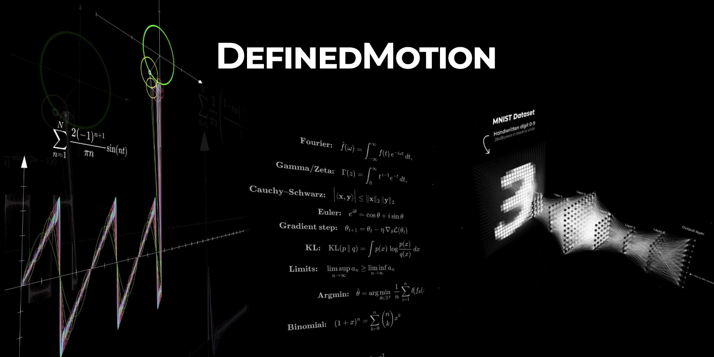

<p align="center">
  
</p>

# DefinedMotion

DefinedMotion is a TypeScript/Three.js system for deterministic 2D and 3D technical animation. This repository contains the runtime and viewer, project generator, packaged examples/tests, and automation tooling.

## Start a project

DefinedMotion requires Node.js 24.11 or newer.

```bash
npx create-definedmotion my-video
cd my-video
npm install
npm run dev
```

The viewer hot-reloads scene source, switches among registered scenes, scrubs the global frame timeline, and renders final video. The CLI provides exact stills, grids, semantic inspection, collision checking, scene-defined verification, and rendering for agents and CI.

## Documentation

- [Package overview](packages/definedmotion/README.md)
- [Canonical documentation](packages/definedmotion/documentation/index.md)
- [Agent workflow](packages/definedmotion/reference/agent-workflow.md)
- [Versioned examples and tests](packages/definedmotion/reference/INDEX.md)

Proposals under [`proposals/`](proposals/) record design work; they are not the source of truth for shipped behavior.

## Repository development

```bash
npm install
npm test
npm run build
npm run pack:check
npm run test:full
```

Packages live under `packages/definedmotion` and `packages/create-definedmotion`; `playground` is the local consumer project.
